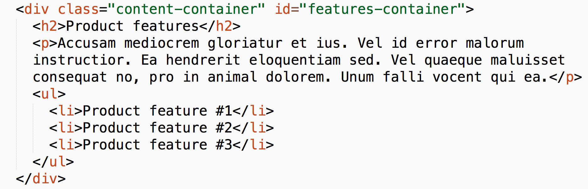

#FEWD - Layout

###Lesson #4 - Feb 10, 2016

"To the left to the left, everything you own in the box to the left."

\- <a href="https://www.youtube.com/watch?v=tohjReLhfoI">Beyonce</a> (obviously singing about floats)

---

##Agenda

*	Review
*	Divs, Classes and IDs
*	HTML5 Structural Elements
*	Floats
*	Lab Time 

---

##Exit Tickets + Review

*	More on `div`

Answer: Our first topic tonight!

*	If there's more than one way to structure/style a page, is there one way that's "best"?

Answer: It will depend on each specific project, the audience, the overall scope; as you develop your skills, you will refine a sense of balancing these needs and choosing the right direction for you codebase.

* 	DOM tree drawing and modifying

Answer: Keep practicing!  Here's <a href="http://gojs.net/latest/samples/DOMTree.html">a nice interactive DOM tree example</a>, and here's <a href="http://javascript.info/tutorial/dom-nodes">a great explanation of the Document Object Model</a>.

---

##Exit Tickets + Review

*	Can you have too many `div`s?

Answer: Depending on the browser and the user's system, at a certain point, browsers may have a hard time rendering a lot of DOM elements (not just `div`s).  But aside from performance issues (which, realistically, won't be much of an issue unless you're working with a HUGE dataset or a lot of interactive components), not really!

*	What is the best way to remember how the box model affects your spacing, i.d "text-align"?

Answer: Practice + interacting with your projects via Chrome Inspector.

*	Is there a "golden rule" when using margins and padding to style a page?

Answer: The basic "golden rule" to remember is that padding adds space INSIDE a box, while margin adds space OUTSIDE a box.

---

## div

###What is a `div`?

A `div` is a type of tag that you used to group items together on a page.

###What are some common reasons for a `div`?

Most commonly, you will use `div`s to separate content structurally that needs to be grouped together and styled together; for example, consider the Relaxr landing page Assignment file.

---

##class & id

With classes and ids we can target specific elements on a page, so we can manipulate them uniquely.

---

##class & id

---

##class & id

###BEST PRACTICE ALERT!
###Never use spaces or capitalization in either a class or id value.
###Class and id attribute values should always be completely lowercased and "dash-delimited" (that means word breaks are denoted using a dash).

---

##class & id

**DO**:

*	`<h1 class="title">`
*	`<h1 class="main-title">`
*	`<h1 class="main-header-title">`

**DON'T**

*	`<h1 class="Title">`
*	`<h1 class="mainTitle">` [This is called *camel-casing* and is used as formatting in other languages.]
*	`<h1 class="main header title">` [This applies **three** classes to the h1.]

---

##class & id

---

##class & id

####IDs are unique

####Classes are not unique

---

##class & id

When should you use them?

**Classes** are meant to be used to provide abstraction for **many** elements (because they are not unique); therefore anytime you are styling something that may share style declarations with another element, it's a good idea to use a class.

**IDs** are meant to be used to provide abstraction for **one** element (because it can only refer to a single, unique element); thus, use an ID where you want to individually call out something as unique (for example, a unique hero image background).

---

##class & id

How to __select__ classes in CSS

`.className`

`#idName`

---

##HTML5 Structural Elements

Adding structure to HTML elements that are related to content layout.

*	header
*	section
*	aside
*	footer

---

##Floats

Float is a CSS positioning property, used to layout a web page. 

Note:
Image from Chris Coyier's CSS-Tricks

---

##Floating Sections

---

##Getting started with Relaxr

---

##Resources 

*	<a href="https://css-tricks.com/all-about-floats/">All about floats</a>
*	<a href="http://alistapart.com/article/css-floats-101">CSS Floats 101</a>
*	<a href="http://stackoverflow.com/questions/6939864/what-is-the-difference-between-section-and-div">Difference between `section` and `div`</a>

---
##Homework

*	Assignment #2 - Relaxr Landing page
*	<a href="http://css.maxdesign.com.au/floatutorial/">Floats tutorial</a> (not graded but good practice!)

---
## Exit Ticket - Lesson #4, Topic: Layout

###Please fill out the <a href="https://docs.google.com/forms/d/1Iw2zghHfGgeM1p1G16F6kLi7KViv28tG3HVNnoM3PAc/viewform">exit ticket</a> before you leave

